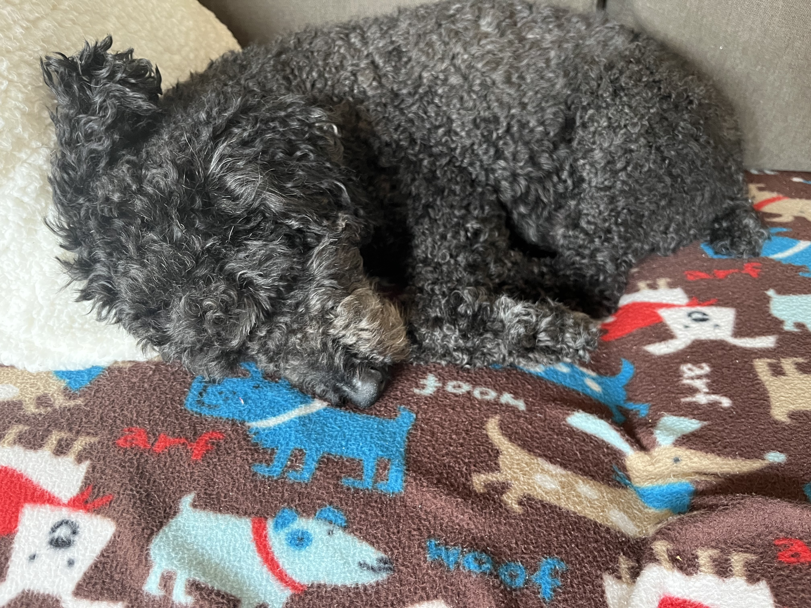
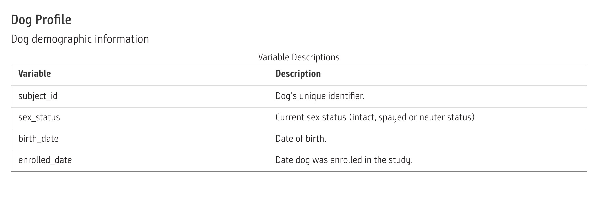
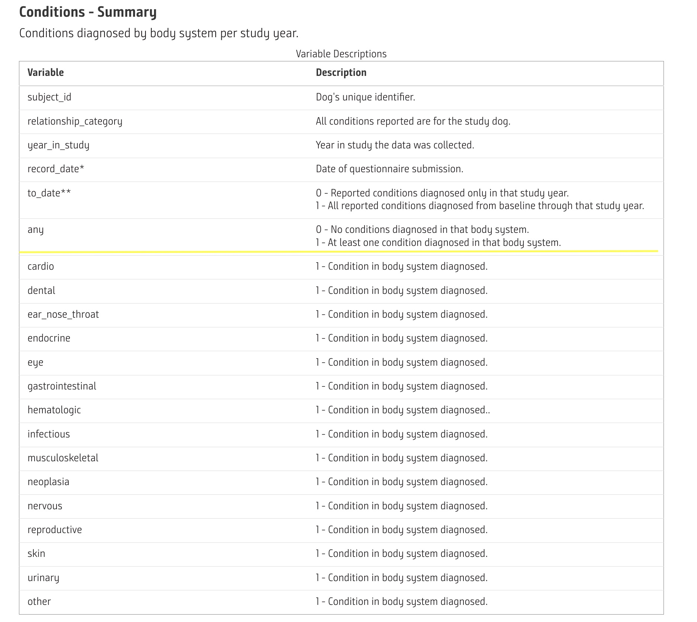
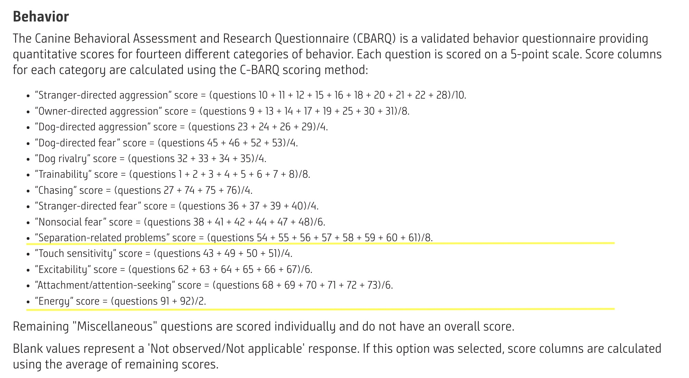
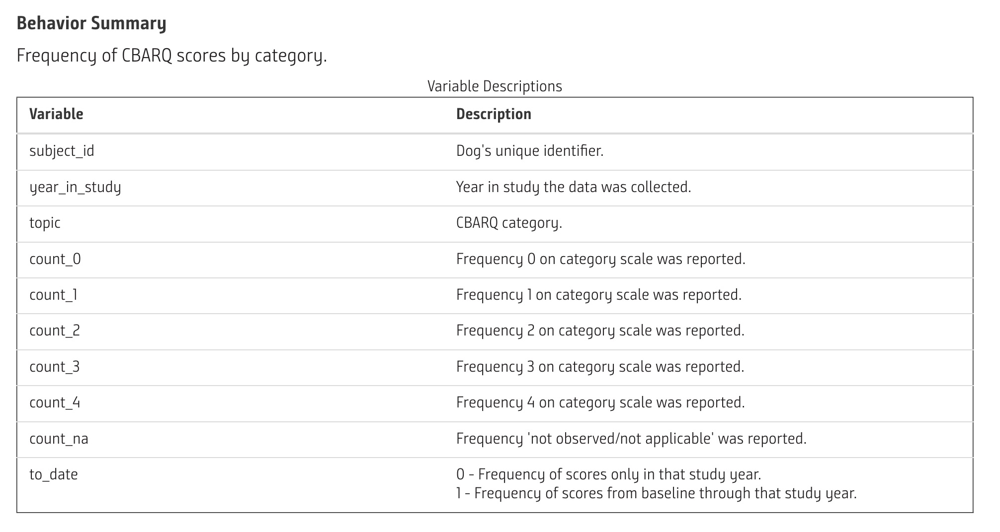
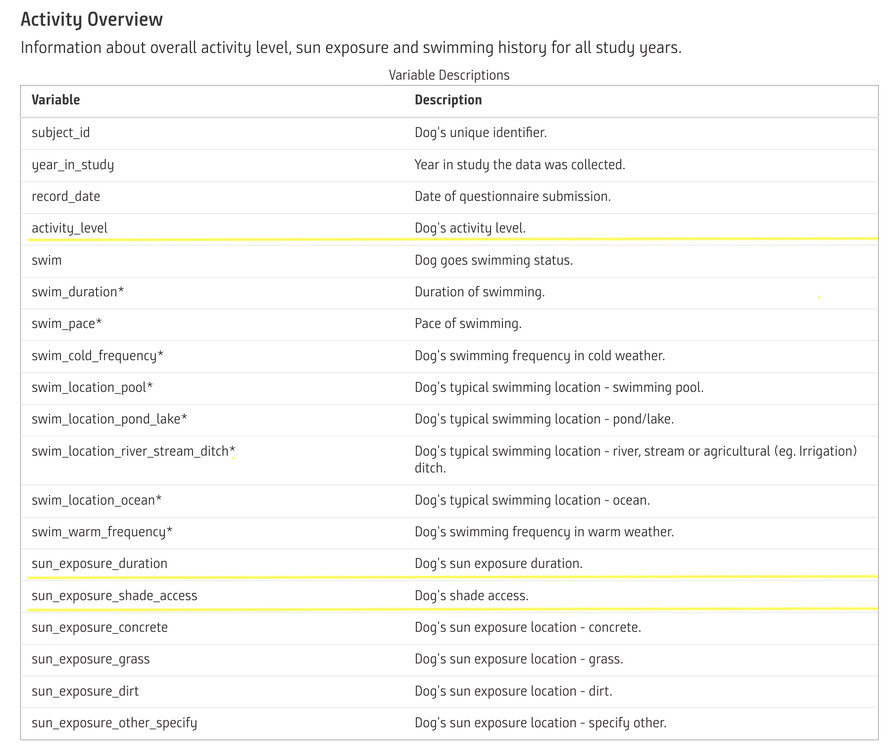
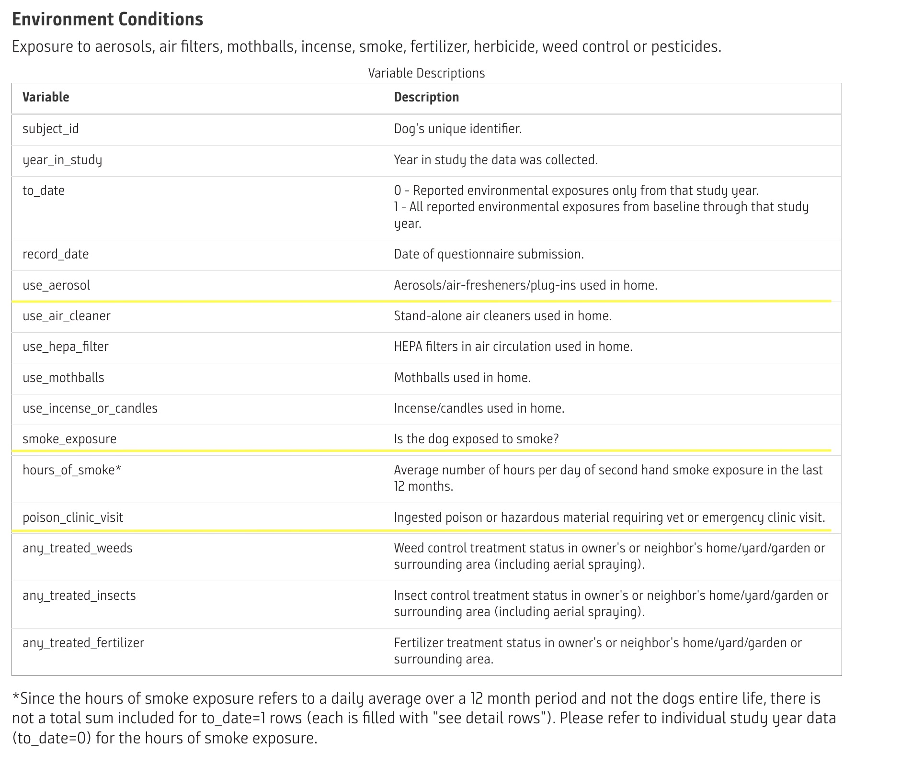

```{r global, include = FALSE}

#### NEED 4 MORE PREDICTORS A LA GUIDELINES, WILL BE BEHAVIOR ONCE CLEANED
# Downloading and cleaning data packages
library(here) # helps importing data on different devices
library(dplyr) # pipe commands, data cleaning
library(lubridate) # converting to date type variable
library(stringr) # str_ functions
library(forcats) # factors

# Modeling packages
library(tidymodels) # modelling
library(vip) # variable importance plots
library(glmnet)

# Showcasing data packages
library(ggplot2) # plots
library(flexdashboard)
library(shiny) # shiny dashboard
library(DT)
library(wesanderson)
library(GGally)

# Helper
library(shinyjs)
library(shinyWidgets)
library(rsconnect)
```


```{r downloading_data}
# Import Data 
# My data can be obtained by making an account on this website:
# https://datacommons.morrisanimalfoundation.org/
# The file names have not been changed, but I put all of the data into a 
# folder called "DO_NOT_UPLOAD_DATA", so delete that if you don't have your 
# data in a folder also called that

# Age
profile_data <- read.csv(here("DO_NOT_UPLOAD_DATA", 
                             "dog_profile.csv"))

# Activity, shade vs sun, etc., in a subfolder called "activity_lifestyle"
# get rid of "activity_lifestyle" if you don't have your data in a folder
# called that
activity_data <- read.csv(here("DO_NOT_UPLOAD_DATA", 
                              "activity_lifestyle", 
                              "activity_overview.csv"))

# Presence of illness
conditions_data <- read.csv(here("DO_NOT_UPLOAD_DATA", 
                               "conditions_summary.csv"))

# Has energy score, excitability, trainability, dog rivalry, chasing
# in a subfolder called "behavior" get rid of "behavior" if you don't have your 
# data in a folder called that
behavior_data <- read.csv(here("DO_NOT_UPLOAD_DATA", 
                              "behavior", 
                              "behavior_summary.csv"))

# Home environment
environment_data <- read.csv(here("DO_NOT_UPLOAD_DATA", 
                                  "environment",
                                  "environment_conditions.csv"))


# Converting all dataframes to tibbles
profile_tbl <- as_tibble(profile_data)
activity_tbl <- as_tibble(activity_data)
conditions_tbl <- as_tibble(conditions_data)
behavior_tbl <- as_tibble(behavior_data)
environment_tbl <- as_tibble(environment_data)
```

```{r cleaning_profile_data}
# Making a variable called "starting age" using birth date and enrolled date
# lubridating all dates
profile_w_age <- profile_tbl %>%
  mutate(
    birth_date_new = ym(birth_date),
    enrolled_date_new = ym(enrolled_date),
    starting_age = as.integer(enrolled_date_new - birth_date_new)) %>%
  mutate(neuter_spay = str_trim(as.character(str_extract_all(sex_status, "(.*) "))),
         sex = str_trim(as.character(str_extract_all(sex_status, " (.*)"))),
         neuter_spay_fact = as_factor(case_when(neuter_spay == "Intact" ~ 0,
                                      neuter_spay != "Intact" ~ 1))) %>% 
  select(subject_id, # selecting only columns I am going to use
         neuter_spay_fact,
         sex,
         starting_age,
         birth_date_new,
         enrolled_date_new)

```

```{r cleaning_activity_data}
# Making characters into factors that are ordered specifically
activity_reordered <- activity_tbl %>%
  mutate(
    activity_level_reordered = fct(
      activity_level,
      c("",
        "None",
        "Little",
        "Moderate",
        "Very active")
    ),
    sun_exposure_duration_reordered = fct(
      sun_exposure_duration,
      c(
        "",
        "Less than 3 hours",
        "Between 3-8 hours",
        "Between 8-16 hours",
        "Between 9-16 hours",
        "More than 16 hours"
      )
    ),
    sun_exposure_shade_access_reordered = fct(
      sun_exposure_shade_access,
      c("",
        "No access to full shade",
        "Access to full shade")
    )
  ) %>%
  select( # selecting only columns I need
    subject_id,
    year_in_study,
    activity_level_reordered,
    sun_exposure_duration_reordered,
    sun_exposure_shade_access_reordered
  )

```

```{r cleaning_illness_data}
# Just want presence of illness of any given year
conditions <- conditions_tbl %>%
  filter(to_date == 0) %>%  # to date == 0 means that we are not including presence of sickness in previous years
  select(subject_id,
         year_in_study,
         any) %>%
  drop_na(any) %>% # need NO NAs for the model to work
  mutate(any = as_factor(any))
```


```{r cleaning_behavioral_data}
# Behavioral indicators (scored out of 4, 0 means not a lot, 4 means severe/ a lot)

# separation
behavior_separation <- behavior_tbl %>%
  filter(to_date == 0,
         topic == "score_separation_related_problems") %>%
  mutate(
    count_0_sep = count_0 / 8,
    count_1_sep = count_1 / 8,
    count_2_sep = count_2 / 8,
    count_3_sep = count_3 / 8,
    count_4_sep = count_4 / 8,
    count_na_sep = count_na / 8
  ) %>%
  select(
    subject_id,
    year_in_study,
    count_0_sep,
    count_1_sep,
    count_2_sep,
    count_3_sep,
    count_4_sep
  )

behavior_energy <- behavior_tbl %>%
  filter(to_date == 0,
         topic == "score_energy") %>%
  mutate(count_0_energy = count_0 / 2,
    count_1_energy = count_1 / 2,
    count_2_energy = count_2 / 2,
    count_3_energy = count_3 / 2,
    count_4_energy = count_4 / 2,
    count_na_energy = count_na / 2) %>%
  select(subject_id,
    year_in_study,
    count_0_energy,
    count_1_energy,
    count_2_energy,
    count_3_energy,
    count_4_energy)

```

```{r cleaning_environment_data}
# Taking the variables I want to use (binary is there smoke, is there aerosols, has the dog been to the ER)
environment_selected <- environment_tbl %>% 
  filter(to_date == 0) %>% 
  mutate(smoke_exposure_fact = as_factor(smoke_exposure),
         poison_clinic_visit_fact = as_factor(poison_clinic_visit),
         use_aerosol_fact = as_factor(use_aerosol)) %>% 
  select(subject_id,
         year_in_study,
         smoke_exposure_fact,
         poison_clinic_visit_fact,
         use_aerosol_fact)
```

```{r joining_data}
# Joining the data
data_y_all <- full_join(profile_w_age,
                        activity_reordered,
                        by = "subject_id") %>%
  full_join(conditions,
            by = c("subject_id",
                   "year_in_study")) %>%
  full_join(behavior_separation,
            by = c("subject_id",
                   "year_in_study")) %>%
  full_join(behavior_energy,
            by = c("subject_id",
                   "year_in_study")) %>% 
  full_join(environment_selected,
            by = c("subject_id",
                   "year_in_study")) %>% 
  na.omit()

```

Sidebar {.sidebar}
===========================================================

<br>

`r h4("Objective:")`
`r h4("Predict whether a golden retriever will have an illness present based on selected inputs.")`

<br>

- - -

```{r function}
# adds all behavioral scores related to a topic to a list
topic_add <- function (input, topic) {
  if (str_detect(str_flatten(input, collapse = ", "),
                 str_c("count_0", topic, sep = "_"))) {
    input.new <- c(
      input,
      str_c("count_1", topic, sep = "_"),
      str_c("count_2", topic, sep = "_"),
      str_c("count_3", topic, sep = "_"),
      str_c("count_4", topic, sep = "_")
    )
    return(input.new)
  }
  else{
    return(input)
  }
}

```


```{r inputs}
# Year in Study as a reactive input
sliderInput(
  inputId = "year_input",
  label   = h5("Year in Study"),
  value   = min(data_y_all$year_in_study),
  min     = min(data_y_all$year_in_study),
  max     = max(data_y_all$year_in_study),
  step    = 1,
  ticks   = FALSE
)

br()

sliderInput(
  inputId = "training_slider",
  label   = h5("Training Data Proportion"),
  min     = 0.10,
  max     = 0.90,
  value   = 0.75,
  step    = 0.05,
  ticks   = FALSE)
  

br()
br()

# Letting a use choose which variables to include in the model
awesomeCheckboxGroup(
  inputId = "model_variables",
  label = h5("Variables to Include in Model"),
  choices = c(
    "sex" = "sex",
    "neutered/spayed, or intact?" = "neuter_spay_fact",
    "age at start of study" = "starting_age",
    "activity level" = "activity_level_reordered",
    "sun exposure" = "sun_exposure_duration_reordered",
    "does the dog have access to shade?" = "sun_exposure_shade_access_reordered",
    "does the dog have separation anxiety?" = "count_0_sep",
    "does the dog have high energy; do they act 'puppyish'?" = "count_0_energy",
    "does the dog get exposed to smoke?" = "smoke_exposure_fact",
    "has ingested poison or hazardous material requiring vet or emergency clinic visit?" = "poison_clinic_visit_fact",
    "exposed to aerosols in the home" = "use_aerosol_fact"),
  inline = FALSE,
  status = wes_palette("Cavalcanti1", 1)
)

br()
br()

actionButton(inputId = "apply", label = "Apply Changes", icon = icon("play"))
actionButton(inputId = "reset", label = "Reset", icon = icon("sync"))

br()

# there is something wrong with the click(), it is not getting rid of things
observeEvent(eventExpr = input$reset, handlerExpr = {
  
  # updates slider for year in study
  updateSliderInput(
    session = session,
    inputId = "year_input",
    value   = min(data_y_all$year_in_study))
  
  # updates model variables
  updateAwesomeCheckboxGroup(
    session = session,
    inputId = "model_variables",
    selected = character(0))
  
  #updates training data proportion
  updateSliderInput(
    session = session,
    inputId = "training_slider",
    value   = 0.75
  )
  
  
  # makes reset complete
  shinyjs::delay(ms = 300, expr = {
    shinyjs::click("apply")
    })
  
})
```

```{r data_filtered}
# creating function golden_filtered(), which is reactive and lets the user change
# what year's data they are looking at

golden_filtered <- eventReactive(
  eventExpr = input$apply,
  valueExpr = {
    data_y_all %>%
      select(any,
             year_in_study,
             topic_add(topic_add(input$model_variables, "sep"), "energy")) %>%
      filter(year_in_study == input$year_input) %>% # getting the datasets from specific years
      select(-year_in_study)
  },
  ignoreNULL = FALSE
)

```

```{r data_splitting}
# Data splitting and re-sampling
set.seed(123)

splits <- eventReactive(
  eventExpr = input$apply,
  valueExpr = {
    initial_split(golden_filtered(), 
                  strata = any,
                  prop = input$training_slider)
  },
  ignoreNULL = FALSE
)


golden_other <- reactive({
  training(splits())
})


golden_test  <- reactive({
  testing(splits())
})

# Create a validation set
set.seed(234)
prop.validation <- .10

val_set <- reactive({
  validation_split(golden_other(),
                   strata = any,
                   prop   = 1 - prop.validation)
})

```

```{r model}
lr_model_golden <- logistic_reg(mixture = 1, 
                                penalty = tune()) %>% 
  set_engine("glmnet")
```

```{r recipe}
lr_recipe_golden <- eventReactive(eventExpr = input$apply,
                        valueExpr = {
  recipe(any ~ ., data = golden_other()) %>%  
    step_dummy(all_nominal(), -all_outcomes()) %>% 
    step_zv(all_predictors()) %>% 
    step_normalize(all_predictors()) %>% 
    step_corr(all_predictors())
                          },
  ignoreNULL = FALSE
  )
```

```{r workflow}
lr_workflow_golden <- reactive({
  workflow() %>% 
  add_model(lr_model_golden) %>% 
  add_recipe(lr_recipe_golden())
})
```

```{r tuning_grid}
# `length.out` will deterrmine how many penalty values are tested in `tune_grid()`
lr_reg_grid_golden <- tibble(penalty = 10^seq(-4, -1, length.out = 10)) 


# Train and tune the model
lr_tune_golden <- reactive({
  lr_workflow_golden() %>% 
  tune_grid(resamples = val_set(), 
            grid      = lr_reg_grid_golden,
            control   = control_grid(save_pred = TRUE), # needed to get data for ROC curve
            metrics   = metric_set(roc_auc))
})


lr_best_golden <- reactive({
  lr_tune_golden() %>% 
  select_best(metric = "roc_auc")
})

```

```{r best_workflow}
# Add best validation model to workflow
lr_workflow_best_golden <- reactive({
  finalize_workflow(
  lr_workflow_golden(),
  lr_best_golden())       # needs to have the same column name as tune()
})

```

```{r fit_training}
# Inspect fit on entire training data
lr_fit_golden <- reactive({
  lr_workflow_best_golden() %>% 
  fit(golden_other())
})

```

```{r last_fit}
lr_last_fit_golden <- reactive({
  last_fit(
    lr_workflow_best_golden(),
    splits())
})

```

```{r confusion_matrix}
lr_conf_mat_golden <- reactive({
  lr_last_fit_golden() %>%
  collect_predictions() %>% 
  conf_mat(truth = any, estimate = .pred_class) 
})


```

`r h5("FAQs on this dataset, usage agreements, and collection methods courtesy of the Morris Animal Foundation:")`
[Morris Animal Foundation Website](https://datacommons.morrisanimalfoundation.org/faq)


Read Me!
===============================================================================


## Basic Information {.tabset}

### Introduction

Hello! My name is Izzy Bedichek, and this is a shiny dashboard that allows you
to interact with golden retriever data. The premise of the dashboard is that it
is a model that is trying to predict the presence of illness in a golden retriever 
given certain changable parameters.
<br>
</br>
The data that I am using is from the Morris Animal Foundation Data Commons, and,
according the their website, "[The] Data Commons provides open access to most of the data collected by the Golden Retriever Lifetime Study, covering 11 key subject areas: activity, behavior, dental, disease diagnoses, diet, environment, grooming, geographical locations, medications, physical exams and reproduction. Data is collected annually on each of the approximately 3,000 golden retrievers in the cohort, sourced from both owners and veterinarians."
<br>
</br> 
I have selected and modified--from character to factor; or separated one 
variable into two, for example--certain variables that I have chosen to put in
this dashboard. They are marked by check boxes, if you click the check box and hit apply, they will enter the model. As this is a longitudinal data set, you can also use the topmost slider bar to change which year in the study you are selecting data from.

### Instructions for Use

**Step 1 (Selecting Data):** Go to the left sidebar, slide to the year and check off
the variables you would like to include in your model. Then hit `Apply`
<br>
</br>
**Step 2 (Model Parameters):** Select the ratio of Training Data : Testing Data for 
your model.
<br>
</br>
**Step 3 (Looking at the Data):** Go to the `Validation Summary` tab. You can view 
the exact numbers of golden retrievers in Training, Testing, and Validation. 
In the right box you can also navigate to three different tabs that display
various ways of looking at the data. 
  - The `Case Imbalance Check` tab shows how
much the outcome (presence of illness, or `any`) is skewed in the sample. 
  - The `Data Viewer` tab shows you a table with all of the check boxes you have checked so 
that you can look at the raw data. 
  - The `Multicollinearity Check via GGpairs` tab shows you a matrix correlation
table of all of your variables. This works with lots of variables, but can be 
difficult to take in all at once. I would suggest clicking 2-4 variables at a time
to look at specific relationships you're interested in for this particular tool.
<br>
</br>
**Step 4 (Viewing the Results):** Go to the `Classification Results` tab back at the 
top of the page. You will see a Confusion Matrix and ROC AUC curve for your 
model! 
  - The Confusion matrix shows you a comparison of which retrievers the model
thought was sick vs well compared to which retrievers were actually sick or well
in the testing set.
  - The ROC AUC shows how _sensitive_ and _specific_ the model was. Sensitive shows 
the models ability to identify a true positive, and specific shows the model's 
ability to identify a true negative. Visually, this will look like the model 
coming off of the linear line in the center to the left. The more curved off 
of that middle line to the left you see, the better your model performed!
<br>
</br>
**Step 5 (What We Really Want to Know):** At the core of this model is the interest
and hopes in identifying concrete things that can cause or are related to the 
presence of illness in retrievers. This can be found in the `Predictor Metrics`
tab on the `Variable Importance Plot`, which shows us which variables impacted the
outcome of this model the most. 
<br>
</br>
**Step 6:** Repeat! Toggle around! Ponder! Try selecting different variables, years, 
and ratios and see how it affects the model. Think about whether this makes sense. 

Column {data-width=350}
--------------------------------------------------------------------------------

### Study Format


### My Dog (not a retriever)



Validation Summary
================================================================================

Column {data-width=350}
--------------------------------------------------------------------------------

### Data Splitting

**Total Observations:**  
`r reactive(dim(golden_filtered())[1] %>% scales::comma())`

**Training Set:**  
`r reactive(dim(golden_other())[1] %>% scales::comma())`

**Validation Set:**  
`r reactive((dim(golden_other())[1] * prop.validation) %>% scales::comma())`

**Testing Set:**  
`r reactive(dim(golden_test())[1] %>% scales::comma())`

### Workflow

`r renderPrint(lr_workflow_golden())`

## Dataset Information {.tabset}

### Case Imbalance Check

```{r, eval = TRUE}
output$case_plot <- renderPlot({
  lr_recipe_golden() %>%
  prep() %>%
  juice() %>%
  ggplot(aes(any, fill = any)) + 
    geom_bar() +
    scale_fill_manual(values = wes_palette("Cavalcanti1"))
})

plotOutput(outputId = "case_plot")
```

### Data Viewer

```{r table}
output$data_viewer <- DT::renderDataTable({
golden_filtered() %>% 
    slice(1:100) %>% 
    datatable(options = list(searching = FALSE,
                           pageLength = 50,
                           lengthMenu = c(50, 100),
                           scrollY = '250px',
                           scrollX = '300px'),
            style = "default")
})

DT::dataTableOutput(outputId = "data_viewer")
```

### Multicollinearity Check via GGpairs

```{r ggpairs}
output$ggpairs_plot <- renderPlot({
  golden_filtered() %>%
    ggpairs(showStrips = TRUE) 
})

plotOutput(outputId = "ggpairs_plot")
```

Classification Results
================================================================================

### Confusion Matrix

```{r confusion}
output$conf_mat_plot_golden <- renderPlot({
  if (length(golden_filtered()) < 3) {
    plot(1,1,col="white")
    text(1,1,"You need to select more variables for this plot to appear")
  } else{
  lr_conf_mat_golden() %>%
    autoplot(type = "heatmap") 
      
  }

})

plotOutput(outputId = "conf_mat_plot_golden")

# Helped:
# https://stackoverflow.com/questions/30047010/shiny-custom-warning-error-messages 
```


### ROC AUC

```{r rocauc}
output$lr_auc_golden <- renderPlot({
   if (length(golden_filtered()) < 3) {
    plot(1,1,col="white")
    text(1,1,"You need to select more variables for this plot to appear")
  } else{
  lr_tune_golden() %>%
  collect_predictions(parameters = lr_best_golden()) %>%
  roc_curve(any, .pred_0) %>%
  ggplot(aes(x = 1 - specificity, y = sensitivity)) +
  geom_path(color = wes_palette("Cavalcanti1", 1, type = "discrete")) +
  geom_abline(lty = 3, color = wes_palette("Cavalcanti1", 1, type = "discrete")) +
  coord_equal() +
  theme_classic()
  }
})

plotOutput(outputId = "lr_auc_golden")


renderPrint(lr_tune_golden()
            %>% collect_predictions(parameters = lr_best_golden()) )
```

Predictor Metrics
===========================================================

Column {data-width=500}
-----------------------------------------------------------------------

### Variable Importance Plot

```{r vip_plot}
output$vip_plot <- renderPlot({ 
   if (length(golden_filtered()) < 3) {
    plot(1,1,col="white")
    text(1,1,"You need to select more variables for this plot to appear")
  } else {
  lr_fit_golden() %>% 
  pull_workflow_fit() %>%
  vip(num_features = 5, 
      aesthetics = list(color = wes_palette("Cavalcanti1", 1, type = "continuous"), 
                     fill = wes_palette("Cavalcanti1", 1, type = "continuous")))
  }
})

plotOutput(outputId = "vip_plot")
```


Data Dictionary
================================================================================


## Variable Categories {.tabset}

### Demographics



### Any Presence of Illness



### Behavior Score Calculation 



### Behavior Summary



### Activity



### Environment



